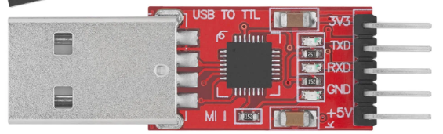
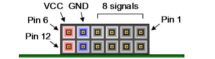

# Conexion Modulo TTL-USB a la FPGA para practica 2



- Conectar el pin GRD del modulo al GRD del PMOD JA
- Conectar el pin TXD del modulo al pin 1 del PMOD JA



No es necesario conectar el pin de Vcc del modulo. 
El modulo funciona con Vref 3.3V, verificado con multímetro: pines RXD y TXD en idle ≈ 3.3 V.

## Monitor serie en la pc

Para encontrar el puerto usb a conectar:

```bash
ls /dev/ttyUSB*
```

Abrir el puerto **sin control de flujo**, baud rate 115200 y 8N1.

```bash
# con minicom:
minicom -D /dev/ttyUSBX -b 115200
# dentro de minicom: desactivar HW y SW flow control (Ctrl-A O → Serial port setup) y activar eco (opcional)
# o con picocom:
picocom -b 115200 --echo --omap crlf --flow n /dev/ttyUSBX
```

